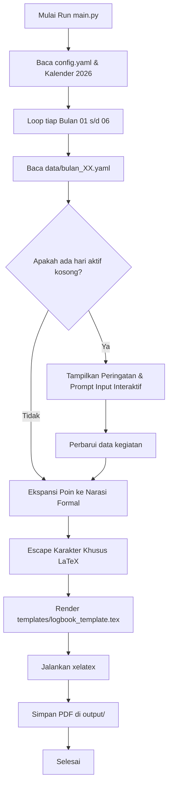

# Desain Sistem Otomatisasi Log Book Magang Industri Polinema

## 1. Ringkasan & Tujuan
Sistem otomatisasi untuk pengisian dan kompilasi log book kegiatan magang industri Program Studi Sarjana Terapan Teknik Informatika, Politeknik Negeri Malang (Polinema) di PT Naraya Telematika. 
Periode magang: **1 Juli 2026 s/d 31 Desember 2026**.

Sistem ini mengubah alur manual (isi cell Word satu per satu) menjadi alur terstruktur berbasis data YAML, validasi tanggal interaktif, generator narasi formal, dan kompilasi langsung ke dokumen PDF siap cetak melalui XeLaTeX.

---

## 2. Kebutuhan & Aturan Bisnis

1. **Jadwal Kerja**:
   - 6 hari kerja per minggu: Senin s/d Sabtu (Minggu libur/dilewati).
   - Jam masuk normal: `08.00`
   - Jam pulang:
     - Senin – Jumat: `16.00`
     - Sabtu: `14.00`
2. **Kekhususan Tanggal**:
   - Tanggal mulai: Rabu, 1 Juli 2026.
   - Tanggal selesai: Kamis, 31 Desember 2026.
   - Minggu ke-1 dimulai langsung pada hari aktif: Rabu 1 Juli s/d Sabtu 4 Juli (tidak menampilkan hari kosong sebelum 1 Juli).
3. **Validasi & Reminder Input**:
   - Jika ada hari kerja aktif yang belum diisi di file data bulanan, script memberikan daftar tanggal yang bolong dan meminta input ulang secara interaktif di terminal atau meminta pengguna melengkapi YAML.
4. **Ekspansi Narasi (Hybrid)**:
   - Pengguna cukup menulis poin singkat (misal: `setup laptop dan clone repo`).
   - Generator otomatis mengembangkan poin tersebut menjadi kalimat kegiatan industri formal dan profesional.
   - Mendukung escape karakter khusus LaTeX (`&`, `%`, `_`, `$`, `#`, dll.).
5. **Layout & Penomoran Halaman**:
   - Format ketat: Tepat 1 minggu = 1 halaman A4.
   - Setiap halaman memuat:
     - Kop surat resmi Polinema (Logo Kemendikbudristek & Polinema).
     - Judul log book & tabel identitas mahasiswa.
     - Tabel kegiatan mingguan.
     - Blok tanda tangan lengkap (Mahasiswa, Dosen Pembimbing, Pembimbing Lapangan).
6. **Output Bundling**:
   - 6 berkas PDF bulanan terpisah untuk pelaporan berkala per bulan ke dosen pembimbing:
     - `Logbook_01_Juli_2026.pdf` (Minggu 1–5)
     - `Logbook_02_Agustus_2026.pdf` (Minggu 6–9)
     - `Logbook_03_September_2026.pdf` (Minggu 10–14)
     - `Logbook_04_Oktober_2026.pdf` (Minggu 15–18)
     - `Logbook_05_November_2026.pdf` (Minggu 19–22)
     - `Logbook_06_Desember_2026.pdf` (Minggu 23–27)
   - 1 berkas PDF kumulatif: `Logbook_Lengkap_Juli_Desember_2026.pdf`.

---

## 3. Struktur Proyek

```text
log-book/
├── assets/
│   ├── kemendikbud.jpg         # Logo Kementerian Pendidikan Tinggi
│   └── polinema.png            # Logo Politeknik Negeri Malang
├── config.yaml                 # Profil mahasiswa, mitra, dosen, pembimbing lapangan
├── data/
│   ├── bulan_01_juli.yaml
│   ├── bulan_02_agustus.yaml
│   ├── bulan_03_september.yaml
│   ├── bulan_04_oktober.yaml
│   ├── bulan_05_november.yaml
│   └── bulan_06_desember.yaml
├── templates/
│   └── logbook_template.tex    # Master template LaTeX modular
├── scripts/
│   ├── extract_assets.py       # Ekstraktor gambar dari docx asli
│   ├── calendar_utils.py       # Generator range minggu & pembagian bulan
│   ├── narrative_expander.py   # Pengubah poin singkat ke kalimat formal
│   └── latex_builder.py        # Pengisi template & compiler xelatex
├── main.py                     # CLI orkestrasi (generate, validate, interactive prompt)
├── docs/
│   └── superpowers/specs/
│       └── 2026-09-18-logbook-automation-design.md
└── output/                     # Direktori hasil kompilasi PDF
```

---

## 4. Spesifikasi Data & Skema

### 4.1 `config.yaml`
```yaml
mahasiswa:
  nama: "Nama Mahasiswa"
  nim: "XXXXXXXXXX"
  prodi: "Sarjana Terapan Teknik Informatika"
  mitra: "PT Naraya Telematika"

pembimbing:
  dosen:
    nama: "Nama Dosen Pembimbing, M.Kom."
    nip: "198XXXXXXXXXXXX"
  lapangan:
    nama: "Nama Pembimbing Lapangan"
    nik: "ID/NIK Karyawan"

pengaturan:
  jam_kerja:
    senin_jumat:
      masuk: "08.00"
      pulang: "16.00"
    sabtu:
      masuk: "08.00"
      pulang: "14.00"
```

### 4.2 `data/bulan_XX.yaml`
```yaml
bulan: 7
tahun: 2026
catatan:
  "2026-07-01": "onboarding magang dan setup laptop dev"
  "2026-07-02": "pelajari arsitektur sistem dan codebase klien"
  "2026-07-03": "meeting mingguan tim, review tiket sprint"
  "2026-07-04": "eksplorasi database postgresql modul transaksi"
```

---

## 5. Alur Kerja Logika (Data Flow)



---

## 6. Rencana Pengujian & Verifikasi
1. **Asset Extraction**: Pastikan logo kemendikbud dan polinema terekstrak utuh dengan resolusi tinggi.
2. **Calendar Validation**: Uji rentang 1 Juli - 31 Desember 2026. Pastikan Minggu 1 hanya memuat 1-4 Juli, dan hari Sabtu memiliki jam pulang 14.00.
3. **Missing Date Reminder**: Uji skenario di mana tanggal 02 Juli sengaja dihapus; pastikan CLI memunculkan notifikasi dan prompt pengisian ulang.
4. **Compilation Stability**: Pastikan `xelatex` menghasilkan PDF tanpa overflow halaman (tepat 1 minggu per lembar A4).
5. **Output Inspection**: Verifikasi visual 6 berkas PDF bulanan dan 1 berkas kumulatif.
